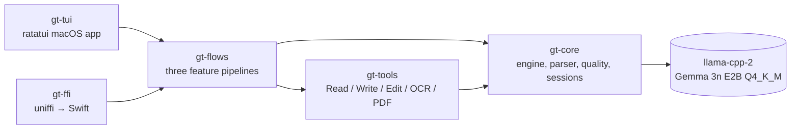
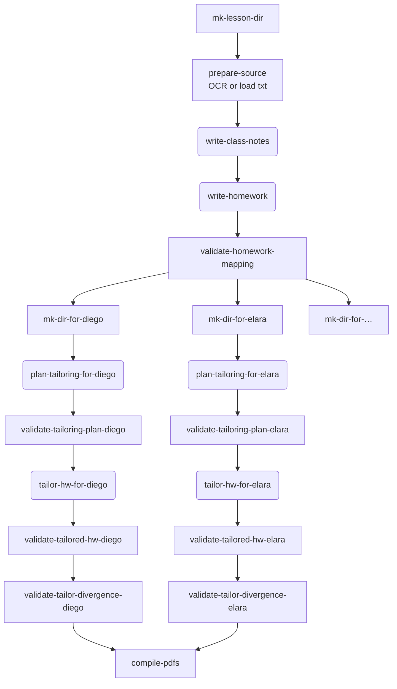

# Gemma Teach — a Claude Code for teachers, running fully on-device

## Abstract

Gemma Teach is a slash-command harness for classroom teachers, powered by Gemma 3n E2B running fully offline on a Mac (Phase 1) and iPhone (Phase 2). It treats lesson planning as a fixed pipeline of small, validated steps rather than open-ended chat — the same architectural commitment that *Claude Code* makes for software engineers, ported to the teaching domain and adapted for the smallest local frontier model. Three slash commands cover the daily loop: `/student-add` builds a structured profile of one student; `/class-plan <chapter>` ingests a textbook chapter, drafts shared class notes and a homework sheet, then personalizes the homework for every student in the notebook; `/student-edit <name>` updates a student profile and refreshes their tags. Nothing leaves the device. The Rust engine is wrapped in a `ratatui` terminal UI on macOS and an `uniffi-rs` FFI surface ready for iOS. This paper documents the architecture, the *scaffold-model fit* discipline that lets a 2 B-parameter model do real agentic work, and the live trace iteration that hardened the system against Gemma 3n's specific quirks.

## The problem

Teachers in classrooms with spotty internet — and teachers who refuse to pipe student names into a SaaS — have been excluded from the LLM productivity wave. Frontier models are powerful but require sending student-identifying notes to a remote API; that is a non-starter under FERPA, GDPR-school-data carve-outs, and the lived ethics of teachers we spoke with. Small local models exist, but the agentic scaffolds shipped today — multi-tool chat agents, autonomous loops, open-ended reasoning chains — were designed around the failure modes of frontier models and *break* on a 2 B-parameter model. Asking Gemma 3n to "be helpful and use these eight tools" does not produce a usable assistant; it produces correction loops, fence-wrapped non-tool-calls, and "Done." emissions before any work is done. The challenge is not "can we make Gemma teach" — it is "can we shape the scaffold around Gemma's actual capabilities so it does useful classroom work reliably enough to ship."

## The bet: scaffold-model fit

This project is the second instance in a research thread that the author calls *scaffold-model fit* (the first instance, [`little-coder`](https://github.com/itayinbarr/little-coder), is a coding agent for small models documented in the paper [*Honey, I Shrunk the Coding Agent*](https://itayinbarr.substack.com/p/honey-i-shrunk-the-coding-agent)). The thesis: small models fail under Claude-style scaffolds because the scaffold assumes capabilities the model does not have. Re-shape the scaffold around capabilities the model *does* have, and the same model becomes useful. Concretely, Gemma 3n E2B reliably does one bounded thing per turn — emit one tool call, or write one short structured artifact — but unreliably plans multi-step trajectories. So the harness does the planning; the model fills in the specifics. Each agent session is single-turn or near-single-turn, sees only the inputs relevant to its narrow task, and is followed by a deterministic validator that fails loudly when the model's output does not satisfy the prompt contract. The result is not a generic chat agent. It is a pipeline of pre-defined teaching flows where the model is invoked at well-bounded inflection points, and every model call is wrapped in a parser that knows Gemma's quirks and a quality monitor that knows what success looks like.

## System overview

The teacher works inside a `ratatui` terminal app that resembles Claude Code's layout — header, tasks pane, detail pane, slash-command input. The user types `/student-add`, `/class-plan`, or `/student-edit`, fills a small modal, and watches a series of pipeline steps light up: deterministic file system steps, agent sessions streaming tokens, and validators that either pass quietly or fail with a prescriptive message telling the user (and the next iteration of the prompt) exactly what went wrong. Behind the UI sits a five-crate Rust workspace whose dependency graph is `gt-tui → gt-flows → gt-tools → gt-core`, with `gt-ffi → gt-flows → gt-core` reserved for the iOS app. The engine crate `gt-core` is FFI-clean — no I/O assumptions, no terminal-specific code, all FFI-safe types — so the same engine ships to Swift via `uniffi-rs` in Phase 2.



The model is Gemma 3n E2B in GGUF Q4_K_M, ~3.5 GB on disk, downloaded on first launch (resumable HTTP plus SHA-256 verification) into `~/.gemma-teach/models/`. Inference runs through `llama-cpp-2` with Metal acceleration; we offload all layers to GPU and pin `n_ctx = 32_768` so a `/class-plan` session can pre-load a full chapter, the master class notes, and a student profile in a single prompt. The teacher's class notebook lives at `~/GemmaTeach/`: `students/<slug>/{student.md, tags.json}` and `lessons/<YYYY-MM-DD>/{source.txt, class-notes.md, homework.md, per-student/<slug>/{tailoring-plan.md, homework.md, homework.pdf}}`. Tesseract handles OCR of PDF chapters; Typst renders Markdown to PDF. No service, no cloud, no telemetry — `tail -f ~/.gemma-teach/logs/gemma-teach-<date>.log` is the only place anything leaves the running process, and it goes to a local file the teacher owns.

## Flow design — `/class-plan`

`/class-plan` is the most architecturally interesting of the three flows because it stretches what a 2 B-parameter model can do under a small-context discipline. The user attaches a chapter PDF (or a `.txt` file, or pastes text directly), and the orchestrator runs the following directed-acyclic graph. Deterministic steps appear as rectangles; agent sessions appear as rounded rectangles. The `tailor` group is bounded by a `tokio` semaphore (default 1, configurable via `GEMMA_TEACH_PARALLELISM`) so the per-student sessions run in parallel up to the available headroom.



The `write-class-notes` session reads the OCR'd chapter and produces a single Markdown file with five fixed sections (`# Title`, `## Learning objectives`, `## Key concepts` containing 3+ `### <concept>` subsections, `## Worked example`, `## Common misconceptions`); the prompt insists the worked example must name a specific entity from the source rather than paraphrasing. `write-homework` produces a five-problem sheet in which every numbered line ends with the literal suffix `(maps to: <Concept Name>)` referencing one of the master's concept headings. The downstream `validate-homework-mapping` step parses the file and rejects the flow if any numbered problem is missing the suffix or names a concept that does not appear in `class-notes.md`. This deterministic post-check is the seam between "small model wrote something" and "we treat the output as load-bearing."

The hard work happens in the per-student sub-tree, which is itself a *decomposition* of what was originally one big tailor-everything-for-this-student session. That single session asked Gemma to simultaneously preserve the master's topic, pick a specific named anchor from inside one of the student's interests, weave the anchor into each concept's prose, write a worked example, and maintain the concept-mapping suffix on five homework problems. Across 30+ recorded traces against the real Gemma 3n model, that single session collapsed into one of two failure modes with frustrating regularity: either it copied the master verbatim with whitespace edits ("the tailor produced a near-identical photosynthesis homework"), or it swapped the topic entirely ("the tailor rewrote photosynthesis as stellar evolution and invented `(maps to: Nebulae)` suffixes that don't exist in class-notes"). Both modes are silent failures — the file looks valid; the work is wrong. We solved this with two complementary moves: a deterministic decomposition into a *planning* step plus a *substitution* step, and two validators that catch each failure mode loudly.

## The plan / substitute decomposition

The `plan-tailoring-for-<slug>` session is small. It reads the student's `student.md`, their `tags.json`, and the concept-and-problem-count skeleton from the master files, and it writes a short Markdown plan that names — for each concept and each homework problem — which student interest to draw from and which *specific element from inside that interest* to use as the anchor. The plan emits as plain Markdown rather than JSON because Gemma 3n consistently misescapes nested-double-quote JSON content, while it handles `key: value` Markdown effortlessly. A live example, captured verbatim from the photosynthesis run on student Diego (a 9th-grader obsessed with trains and dinosaurs):

```
## Concepts
- concept: Chloroplasts
  interest: dinosaurs
  named_element: Allosaurus
- concept: Chlorophyll
  interest: trains
  named_element: GP38-2
- concept: The Light Reaction and Calvin Cycle
  interest: railroad
  named_element: SD40-2

## Problems
- n: 1
  interest: trains
  named_element: Mark Felton
- n: 2
  interest: dinosaurs
  named_element: DK Smithsonian "Dinosaurs!"
- n: 3
  interest: railroad
  named_element: Pacific Northwest narrow-gauge railroads
- n: 4
  interest: trains
  named_element: Train Simulator Classic
- n: 5
  interest: dinosaurs
  named_element: PBS NOVA
```

Notice the model is reaching past the kebab-case tag for *specific things from inside that interest*: `GP38-2` and `SD40-2` are locomotive class names; `Mark Felton` is a YouTuber Diego watches; `DK Smithsonian "Dinosaurs!"` is the encyclopedia he reads. The planner's only job is to pick these anchors. It does that well because the task is small and structured.

The `tailor-hw-for-<slug>` session is also small, but in a different way. Before constructing the prompt, the harness *deterministically expands* the plan into per-problem substitution instructions. The model never sees the plan as JSON or YAML to interpret — it sees, in plain English, one instruction per problem in the form *"Problem 1: rewrite the problem statement so its scenario is Mark Felton (trains). Style: 'In Mark Felton, <problem setup that exercises the same concept as the master's problem 1>.' Keep the master's (maps to: …) suffix verbatim."* This is the load-bearing prompt move of the whole system: by the time the agent sees the master homework, it already has five sentence-stems pre-written. Its job is to finish each sentence by exercising the same concept the master exercised. The model is doing one small substitution per problem, not five reasoning steps in parallel.

Two validators close the loop. `validate-tailored-hw-<slug>` re-runs the concept-mapping check against the per-student file. `validate-tailor-divergence-<slug>` reads both the master and the tailored file, computes the fraction of body lines that differ (after whitespace normalization), and rejects the flow if fewer than $30\%$ of the body lines are new content. Concretely, given the body-line sets $M$ (master) and $T$ (tailored):

$$\text{change\_ratio} = 1 - \frac{|\{l \in T \mid l \in M\}|}{|T|}, \qquad \text{flow fails if } \text{change\_ratio} < 0.30$$

This is intentionally a permissive threshold — a legitimate tailoring keeps the master's reflection prompt, suggested-time string, and other scaffolding, so 50–70 % of body lines being shared is normal. But a tailor that produced "master with one word swapped" comes in around 5–10 % and is rightly rejected. Across our live runs the validator caught silent copies the parser-level checks missed.

## Carrying the little-coder philosophy

Underneath the flow architecture sits the same eight-pattern small-model harness that `little-coder` established and that the paper formalizes. The deterministic output parser runs before any semantic interpretation, repairing the specific shapes Gemma emits that are *almost* JSON tool calls: fenced ` ```tool_code ` blocks containing Python-style kwargs (`Write(path="x.md", content="…")`), bare verb-and-path prose followed by a Markdown body in a code fence, `<tool_call>` XML wrappers, unterminated string literals because the content itself contained a backtick the model conflated with a fence close, smart/curly quotes inside JSON content, and a particularly stubborn `Write -f path -e "content"` Unix-flag-syntax pattern Gemma emits about one run in ten. Each repair pass is added to the parser only after a live trace shows the pattern occurring three or more times; the repair is the smallest possible code change to make that pattern parse, never speculative.

The quality monitor inspects every turn and flags `EmptyResponse`, `EmptyToolName`, `HallucinatedTool`, `RepeatedToolCall` (exact JSON match against the previous turn), and `MalformedArgs`. Each issue maps to a *prescriptive correction* — a steer message containing the exact desired JSON shape, not vague guidance — and is injected into the next turn's system-prompt as a `## Correction` block rather than appended as a new chat message. We cap consecutive corrections at 2; on the 3rd, the session fails cleanly with a `CorrectionLoop` error rather than burning tokens.

Skill cards live in `skills/tools/{read,write,edit}.md`. Each turn ranks them by error-recovery relevance ($+10$ for the previous turn's failed tool), recency ($+3$ for each appearance in the last three turns), and intent-keyword overlap; the top-ranked cards are packed under a $\approx 200$-token budget. Domain knowledge sheets in `skills/knowledge/` are selected the same way against a $\approx 150$-token budget. A thinking-token budget of 1024 fires a forced-commit steer ("Stop deliberating. Use your tools to make progress.") when exceeded, and a per-session turn cap of 15 hard-stops runaway sessions. The `Write` tool's *Write-Guard* refuses on existing files with the literal `Edit` JSON recipe embedded in the error string — a non-negotiable from the little-coder paper, because the alternative is the model spinning on a "file exists" error without knowing the correction.

## Trace-driven iteration

The development loop is record-trace-then-patch. The `record_trace` example wraps any flow in a backend factory and writes every `SessionEvent` and `FlowEvent` as JSONL alongside the artifact tree. We run a flow, eyeball the trace, identify the failure pattern (a new parser quirk, a quality issue the monitor missed, a prompt section the model is regurgitating verbatim), and land one of: a parser fixture plus a repair rule, a quality-monitor variant plus its prescriptive correction text, or a prompt revision. Twenty-plus traces under `traces/phase-2-*.jsonl` document the iteration that produced the current system. Two patterns recurred often enough to deserve naming: the *placeholder echo* (Gemma copies `<bullet>` placeholder text from the prompt template into the file because it cannot tell instruction from content — fixed by reordering sections so the data arrives before the template, and by using `<…>` angle brackets that read as "fill in" rather than "use literally"), and the *over-escape* (Gemma writes a `.json` file whose contents are already escaped, producing `[\"a", \"b"]` on disk; the parser's `try_repair_json_value` strips one layer and re-parses).

## End-to-end: Diego, photosynthesis, and what survived each step

The repository's `samples/showcase/photosynthesis-diego/` directory contains a complete end-to-end run captured against the real Gemma 3n model on an M-series Mac. The narrative follows one student through the entire system so the data transformations are visible at every step.

The teacher's input is the kind of dump a teacher would produce at the end of the first week of school. Diego's free-text profile is 250 words of paragraph-style observations covering his obsession with trains and dinosaurs, his ability to distinguish a `GP38-2` from an `SD40-2` locomotive on sight, his collection of DK Smithsonian dinosaur encyclopedias, his habit of watching Mark Felton's railroad-history shorts, and his learning-style notes — fidgets after ten minutes, writes precisely when given timed five-sentence prompts, reads sarcasm literally and is hurt by it. None of this is structured. The teacher types it once into a 5-field modal.

`/student-add` digests this into a structured `student.md` with the system's five mandatory sections (`## Snapshot`, `## Interests`, `## Hobbies`, `## Media they love`, `## Notes for tailoring lessons`) and a separate `tags.json` that captures the same information as eight kebab-case strings the rest of the system can index against: `["trains", "dinosaurs", "railroad", "ho-scale", "train-simulator", "mark-felton", "dk-smithsonian", "pbs-nova"]`. The `## Notes for tailoring lessons` section is forced by the prompt contract to be operational — each bullet names a specific interest from the profile *and* a specific instructional move. Diego's first tailoring bullet, written by Gemma, reads: *"When introducing trains, reference his interest in trains: Ask him to explain the difference between steam and diesel engines, drawing on his knowledge of the GP38-2 and SD40-2."* That bullet pulls forward the locomotive-class detail from the teacher's free-text dump, the precise place a future class-plan tailoring step can reach for.

`/class-plan samples/chapters/photosynthesis.txt` then runs the full pipeline. `write-class-notes` produces a master `class-notes.md` whose worked example pulls a *named tree* (a maple) from the source rather than paraphrasing — the prompt requires that. `write-homework` produces five problems, each ending with `(maps to: <Concept>)` pointing to one of the master's three `### <concept>` headings; the deterministic validator confirms every suffix references a real concept before the flow proceeds. Both master files compile to PDF and apply to every student in the class.

Then comes Diego's per-student sub-flow. `plan-tailoring-for-diego` reads his `student.md` and `tags.json` plus the master's concept set and emits the Markdown plan shown earlier: `Allosaurus` for `### Chloroplasts`, `GP38-2` for `### Chlorophyll`, `SD40-2` for `### The Light Reaction and Calvin Cycle`, with the five homework problems mapped to `Mark Felton`, `DK Smithsonian "Dinosaurs!"`, `Pacific Northwest narrow-gauge railroads`, `Train Simulator Classic`, and `PBS NOVA`. The planner has reached past the kebab-case interest tags and picked specific elements from inside each interest — the locomotive-class names that came from Diego's free-text dump in the first place, two encyclopedias the teacher named, and the YouTuber Diego watches.

`tailor-hw-for-diego` then sees a prompt whose substitution instructions were deterministically expanded from the plan — five sentence-stems pre-written in the form *"Problem N: rewrite the problem statement so its scenario is `<named_element>` (`<interest>`). Keep the master's `(maps to: …)` suffix verbatim."* — and the model produces the final tailored homework. Every problem now opens with a Diego-specific anchor: *"In Mark Felton, a train engineer needs to ensure the train's brakes are functioning correctly. Describe the first two stages of photosynthesis…"*, *"In DK Smithsonian 'Dinosaurs!', a paleontologist is studying a newly discovered dinosaur fossil. Explain how chlorophyll works to capture sunlight energy…"*, three more in the same vein. The `(maps to: …)` suffix is preserved on every line; `validate-tailored-hw-diego` confirms it; `validate-tailor-divergence-diego` confirms the tailored file diverges from the master by more than $30\%$ of body lines. `compile-pdfs` renders the master class-notes, master homework, and Diego's personalized homework to PDF. The whole run finishes in roughly four minutes on M-series Apple Silicon. Every byte of input and every byte of output lives on the teacher's laptop.

The tailoring as shipped is *good but not great*. The model substitutes each anchor reliably, but it tends to use the anchor as a *setting* rather than as the analogical mechanism — *"In Mark Felton, a train engineer needs to…"* puts Mark Felton in front of the master problem without using his content as the bridge to photosynthesis. The system's theoretical ceiling is *operational* tailoring in which each anchor's *mechanics* explain the concept (the kelp-forests-in-Ponyo example from `skills/knowledge/teaching-basics.md` is the target). The 2 B-parameter model can substitute reliably but cannot reach for genuine analogy on every problem yet; the `docs/tailor-decomposition.md` document specifies the next decomposition (one micro-agent per anchor) that would close that gap. We chose to ship the current state because the divergence validator and the concept-mapping validator together guarantee that nothing sub-par appears as a PDF — when the model fails to substitute, the validator refuses the file and the user re-runs the flow with a clear failure message rather than receiving silent garbage.

## Honest limitations

Tailored *class notes* are the open frontier. The current decomposition handles homework reliably because each problem statement is a single sentence the model can substitute. Class-notes tailoring requires rewriting multi-bullet prose blocks while preserving structure, and that crossed a complexity threshold the 2 B model could not clear consistently — across our trace runs the model either copied the master verbatim or hallucinated unrelated content. We removed the notes-tailor step rather than ship something users would not trust; the system instead presents shared master notes (which mirrors how teachers actually work) plus per-student homework. The `docs/tailor-decomposition.md` document specifies the per-concept micro-agent decomposition that would unlock tailored notes if a future iteration justifies the additional complexity. The system is also explicit about its model-variance behavior — when the divergence validator rejects a student's homework because the model produced a near-copy, the user gets a clear failure message and re-runs the flow rather than getting a silently sub-par PDF.

## Why this is the *Future of Education* track

We did not build a tutoring chatbot. We built a *tool for the teacher*, running on the teacher's laptop, that respects every constraint a school IT department actually cares about: no internet required after the one-time model download, no student data leaving the device, all artifacts written to a directory the teacher can audit and archive, and the model itself is open-weight and inspectable. The interface is intentionally familiar to anyone who has used Claude Code — slash commands, a tasks pane, streaming token output — because that interface has already taught a generation of software engineers how to collaborate with a model on bounded, validated tasks. We claim the same shape works for teachers, and the `samples/showcase/` artifacts are the evidence. Phase 2's iPhone target makes this real for a parent-teacher conference or a substitute teacher who needs to print personalized homework for tomorrow morning from the train home. The technical contribution — scaffold-model fit, decomposed agent flows with deterministic validators, parser hardening from live traces — generalizes well past the classroom; *Future of Education* is the first place we are shipping it because that is where the offline-and-private constraint is the most binding.
