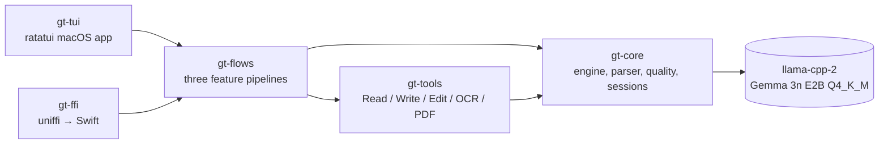
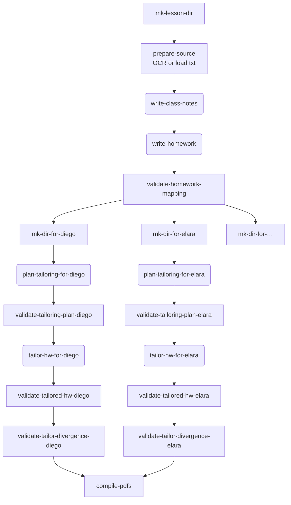

# Gemma Teach — a Claude Code for teachers, running fully on-device

## Abstract

Gemma Teach is a slash-command harness for classroom teachers, powered by Gemma 3n E2B running fully offline on a Mac (Phase 1) and iPhone (Phase 2). It treats lesson planning as a fixed pipeline of small, validated steps rather than open-ended chat — the same architectural commitment that *Claude Code* makes for software engineers, ported to the teaching domain and adapted for the smallest local frontier model. Three slash commands cover the daily loop: `/student-add` builds a structured profile of one student; `/class-plan <chapter>` ingests a textbook chapter, drafts shared class notes and a homework sheet, then personalizes the homework for every student in the notebook; `/student-edit <name>` updates a student profile and refreshes their tags. Nothing leaves the device. The Rust engine is wrapped in a `ratatui` terminal UI on macOS and an `uniffi-rs` FFI surface ready for iOS. This paper documents the architecture, the *scaffold-model fit* discipline that lets a 2 B-parameter model do real agentic work, and the live trace iteration that hardened the system against Gemma 3n's specific quirks.

## The problem

Teachers in classrooms with spotty internet — and teachers who refuse to pipe student names into a SaaS — have been excluded from the LLM productivity wave. Frontier models are powerful but require sending student-identifying notes to a remote API; that is a non-starter under FERPA, GDPR-school-data carve-outs, and the lived ethics of teachers we spoke with. Small local models exist, but the agentic scaffolds shipped today — multi-tool chat agents, autonomous loops, open-ended reasoning chains — were designed around the failure modes of frontier models and *break* on a 2 B-parameter model. Asking Gemma 3n to "be helpful and use these eight tools" does not produce a usable assistant; it produces correction loops, fence-wrapped non-tool-calls, and "Done." emissions before any work is done. The challenge is not "can we make Gemma teach" — it is "can we shape the scaffold around Gemma's actual capabilities so it does useful classroom work reliably enough to ship."

## The bet: scaffold-model fit

The thesis is straightforward: small models fail under Claude-style scaffolds because the scaffold assumes capabilities the model does not have. Re-shape the scaffold around capabilities the model *does* have, and the same model becomes useful. Concretely, Gemma 3n E2B reliably does one bounded thing per turn — emit one tool call, or write one short structured artifact — but unreliably plans multi-step trajectories. So the harness does the planning; the model fills in the specifics. Each agent session is single-turn or near-single-turn, sees only the inputs relevant to its narrow task, and is followed by a deterministic validator that fails loudly when the model's output does not satisfy the prompt contract. The result is not a generic chat agent. It is a pipeline of pre-defined teaching flows where the model is invoked at well-bounded inflection points, and every model call is wrapped in a parser that knows Gemma's quirks and a quality monitor that knows what success looks like.

## System overview

The teacher works inside a `ratatui` terminal app that resembles Claude Code's layout — header, tasks pane, detail pane, slash-command input. The user types `/student-add`, `/class-plan`, or `/student-edit`, fills a small modal, and watches a series of pipeline steps light up: deterministic file system steps, agent sessions streaming tokens, and validators that either pass quietly or fail with a prescriptive message telling the user (and the next iteration of the prompt) exactly what went wrong. Behind the UI sits a five-crate Rust workspace whose dependency graph is `gt-tui → gt-flows → gt-tools → gt-core`, with `gt-ffi → gt-flows → gt-core` reserved for the iOS app. The engine crate `gt-core` is FFI-clean — no I/O assumptions, no terminal-specific code, all FFI-safe types — so the same engine ships to Swift via `uniffi-rs` in Phase 2.



The model is Gemma 3n E2B in GGUF Q4_K_M, ~3.5 GB on disk, downloaded on first launch (resumable HTTP plus SHA-256 verification) into `~/.gemma-teach/models/`. Inference runs through `llama-cpp-2` with Metal acceleration; we offload all layers to GPU and pin `n_ctx = 32_768` so a `/class-plan` session can pre-load a full chapter, the master class notes, and a student profile in a single prompt. The teacher's class notebook lives at `~/GemmaTeach/`: `students/<slug>/{student.md, tags.json}` and `lessons/<YYYY-MM-DD>/{source.txt, class-notes.md, homework.md, per-student/<slug>/{tailoring-plan.md, homework.md, homework.pdf}}`. Tesseract handles OCR of PDF chapters; Typst renders Markdown to PDF. No service, no cloud, no telemetry — `tail -f ~/.gemma-teach/logs/gemma-teach-<date>.log` is the only place anything leaves the running process, and it goes to a local file the teacher owns.

## Flow design — `/class-plan`

`/class-plan` is the most architecturally interesting of the three flows because it stretches what a 2 B-parameter model can do under a small-context discipline. The user attaches a chapter PDF (or a `.txt` file, or pastes text directly), and the orchestrator runs the following directed-acyclic graph. Deterministic steps appear as rectangles; agent sessions appear as rounded rectangles. The `tailor` group is bounded by a `tokio` semaphore (default 1, configurable via `GEMMA_TEACH_PARALLELISM`) so the per-student sessions run in parallel up to the available headroom.



The `write-class-notes` session reads the OCR'd chapter and produces a single Markdown file with five fixed sections (`# Title`, `## Learning objectives`, `## Key concepts` containing 3+ `### <concept>` subsections, `## Worked example`, `## Common misconceptions`); the prompt insists the worked example must name a specific entity from the source rather than paraphrasing. `write-homework` produces a five-problem sheet in which every numbered line ends with the literal suffix `(maps to: <Concept Name>)` referencing one of the master's concept headings. The downstream `validate-homework-mapping` step parses the file and rejects the flow if any numbered problem is missing the suffix or names a concept that does not appear in `class-notes.md`. This deterministic post-check is the seam between "small model wrote something" and "we treat the output as load-bearing."

The hard work happens in the per-student sub-tree, which is itself a *decomposition* of what was originally one big tailor-everything-for-this-student session. Asking a 2 B-parameter model to simultaneously preserve the master's topic, pick a specific named anchor from inside one of the student's interests, weave the anchor into each concept's prose, write a worked example, and maintain the concept-mapping suffix across five homework problems is asking too many decisions in one turn — exactly the kind of multi-decision step the scaffold-model-fit discipline says to split. We split it into a *planning* agent that emits a short structured artifact and a *substitution* agent that takes the plan as fixed context, and we added two deterministic validators — concept-set membership and divergence-from-master — so any failure mode the model still produces is surfaced loudly at the seam between steps rather than shipped as a PDF.

## The plan / substitute decomposition

The `plan-tailoring-for-<slug>` session is small. It reads the student's `student.md`, their `tags.json`, the concept-and-problem skeleton from the master class-notes and master homework — including each numbered master problem verbatim — and emits a short Markdown plan that names, for every concept and every homework problem, which interest to draw from, which specific element inside that interest to anchor on, and a one-line *scenario* whose concrete numbers or named entities can serve as the operands of that problem's operation. The plan emits as plain Markdown rather than JSON because Gemma 3n consistently misescapes nested-double-quote JSON content, while it handles `key: value` Markdown effortlessly. A live example, captured verbatim from the fractions run on student Diego (a 6th-grader who lives and breathes Barcelona FC):

```
## Problems
- n: 1
  # master problem to mirror: 1. Find an equivalent fraction for 2/3.
  interest: barcelona-fc
  named_element: 2
  scenario: Barcelona scored 2 goals out of 3 shots in the first half
- n: 2
  # master problem to mirror: 2. Explain why the ratio 4:8 simplifies to 2:2.
  interest: dragon-ball-z
  named_element: 4
  scenario: Goku has a power level of 4,000 while Vegeta has 18,000
- n: 5
  # master problem to mirror: 5. Simplify the ratio 12:18.
  interest: dragon-ball-z
  named_element: 12
  scenario: Goku has a power level of 12,000 while Vegeta has 18,000
```

Notice the planner is doing the genuinely interesting work — for problem 1's *find an equivalent fraction for 2/3* it picks a Barcelona match scoreline (`2` goals out of `3` shots) whose two numbers can BE the fraction's numerator and denominator; for problem 2's *explain why the ratio 4:8 simplifies* it picks two Dragon Ball Z power levels (`4,000` and `18,000`) whose ratio Diego can compute. The scenario is load-bearing because it supplies the operands; without it the next step has nothing concrete to substitute.

The `tailor-hw-for-<slug>` session sees a deterministically-built FILL-IN-THE-BLANK template, not the master homework. The harness reads the master homework's numbered problems and writes a template like *"1. <one or two sentences. The OPERATION the original problem asked for: \"Find an equivalent fraction for 2/3.\". The SCENARIO you must use (from barcelona-fc): \"Barcelona scored 2 goals out of 3 shots in the first half\". Use the scenario's concrete numbers as the operands the operation acts on.> (maps to: Equivalent Fractions)"* for every problem. The model's only job is to replace each `<…>` slot with one or two sentences. Because there is no master text in the context for the model to fall back to, Gemma 3n stops defaulting to the verbatim copy that defeated every earlier iteration of this step.

Three deterministic steps close the loop. A `restore-hw-suffixes-<slug>` step appends any `(maps to: <Concept>)` suffix the model dropped during rewriting — Gemma reliably treats the suffix as decoration when busy with the problem body, and the harness handles bookkeeping rather than burning prompt tokens on a reminder. `validate-tailored-hw-<slug>` then re-runs the concept-mapping check against the per-student file. `validate-tailor-divergence-<slug>` reads both the master and the tailored file, computes the fraction of body lines that differ (after whitespace normalization), and rejects the flow if fewer than $30\%$ of the body lines are new content. Concretely, given the body-line sets $M$ (master) and $T$ (tailored):

$$\text{change\_ratio} = 1 - \frac{|\{l \in T \mid l \in M\}|}{|T|}, \qquad \text{flow fails if } \text{change\_ratio} < 0.30$$

This is intentionally a permissive threshold — a legitimate tailoring keeps the master's reflection prompt, suggested-time string, and other scaffolding, so 50–70 % of body lines being shared is normal. But a tailor that produced "master with one word swapped" comes in around 5–10 % and is rightly rejected. Across our live runs the validator caught silent copies the parser-level checks missed.

## The small-model harness underneath

Underneath the flow architecture sits an eight-pattern small-model harness we built specifically for Gemma 3n. The deterministic output parser runs before any semantic interpretation, repairing the specific shapes Gemma emits that are *almost* JSON tool calls: fenced ` ```tool_code ` blocks containing Python-style kwargs (`Write(path="x.md", content="…")`), bare verb-and-path prose followed by a Markdown body in a code fence, `<tool_call>` XML wrappers, unterminated string literals where the content itself contains a backtick the model conflated with a fence close, smart/curly quotes inside JSON content, and a `Write -f path -e "content"` Unix-flag-syntax variant Gemma falls into roughly one run in ten. Each repair pass is added to the parser only after a live trace shows the pattern occurring three or more times; the repair is the smallest possible code change to make that pattern parse, never speculative.

The quality monitor inspects every turn and flags `EmptyResponse`, `EmptyToolName`, `HallucinatedTool`, `RepeatedToolCall` (exact JSON match against the previous turn), and `MalformedArgs`. Each issue maps to a *prescriptive correction* — a steer message containing the exact desired JSON shape, not vague guidance — and is injected into the next turn's system-prompt as a `## Correction` block rather than appended as a new chat message. We cap consecutive corrections at 2; on the 3rd, the session fails cleanly with a `CorrectionLoop` error rather than burning tokens.

Skill cards live in `skills/tools/{read,write,edit}.md`. Each turn ranks them by error-recovery relevance ($+10$ for the previous turn's failed tool), recency ($+3$ for each appearance in the last three turns), and intent-keyword overlap; the top-ranked cards are packed under a $\approx 200$-token budget. Domain knowledge sheets in `skills/knowledge/` are selected the same way against a $\approx 150$-token budget. A thinking-token budget of 1024 fires a forced-commit steer ("Stop deliberating. Use your tools to make progress.") when exceeded, and a per-session turn cap of 15 hard-stops runaway sessions. The `Write` tool's *Write-Guard* refuses on existing files with the literal `Edit` JSON recipe embedded in the error string — without that prescriptive error, the model spins on a "file exists" failure with no path to recovery.

## Trace-driven iteration

The development loop is record-trace-then-patch. The `record_trace` example wraps any flow in a backend factory and writes every `SessionEvent` and `FlowEvent` as JSONL alongside the artifact tree. We run a flow, eyeball the trace, identify the failure pattern (a new parser quirk, a quality issue the monitor missed, a prompt section the model is regurgitating verbatim), and land one of: a parser fixture plus a repair rule, a quality-monitor variant plus its prescriptive correction text, or a prompt revision. Twenty-plus traces under `traces/phase-2-*.jsonl` document the iteration that produced the current system. Two patterns recurred often enough to deserve naming: the *placeholder echo* (Gemma copies `<bullet>` placeholder text from the prompt template into the file because it cannot tell instruction from content — fixed by reordering sections so the data arrives before the template, and by using `<…>` angle brackets that read as "fill in" rather than "use literally"), and the *over-escape* (Gemma writes a `.json` file whose contents are already escaped, producing `[\"a", \"b"]` on disk; the parser's `try_repair_json_value` strips one layer and re-parses).

## End-to-end: Diego, fractions, and what survived each step

The repository's `samples/showcase/fractions-diego/` directory contains a complete end-to-end run captured against the real Gemma 3n model on an M-series Mac. The narrative follows one student through the entire system so the data transformations are visible at every step. We chose a math chapter for the showcase because mathematical operations have explicit operands — the per-student tailoring uses real numbers from the student's world *as those operands*, not as decorative settings.

The teacher's input is the kind of dump a teacher would produce at the end of the first week of school. Diego's free-text profile is 250 words of paragraph-style observations covering his obsession with Barcelona FC, his ability to recite every El Clasico scoreline, his weekly playlist of Dragon Ball Z reruns, his FIFA-on-PS5 habit, and his learning-style notes — quick with numbers when they're attached to something concrete, lost in abstract worksheets, confident in class but sulks if corrected publicly, anchored best by starting in a soccer scenario and walking backwards to the abstract notation. None of this is structured. The teacher types it once into a 5-field modal.

`/student-add` digests this into a structured `student.md` with the system's five mandatory sections (`## Snapshot`, `## Interests`, `## Hobbies`, `## Media they love`, `## Notes for tailoring lessons`) and a separate `tags.json` that captures the same information as kebab-case strings the rest of the system can index against: `["barcelona-fc", "dragon-ball-z", "street-football", "fifa", "one-punch-man"]`. The `## Notes for tailoring lessons` section is forced by the prompt contract to be operational — each bullet names a specific interest from the profile *and* a specific instructional move. Diego's second tailoring bullet, written by Gemma, reads: *"When introducing abstract mathematical concepts, reference possession percentages: Connect the abstract concept of fractions to the concrete data of possession percentages in a match."* That bullet pulls forward the *fractions ↔ soccer-stats* bridging move from the teacher's free-text dump, the precise place a future `/class-plan` tailoring step can reach for.

`/class-plan samples/chapters/fractions-and-ratios.txt` then runs the full pipeline. `write-class-notes` produces a master `class-notes.md` with three named concepts — *Equivalent Fractions*, *Ratios*, and *Fractions* — each with concrete bullets and a worked example. `write-homework` produces five problems, each ending with `(maps to: <Concept>)` pointing to one of the master's three `### <concept>` headings; the deterministic validator confirms every suffix references a real concept before the flow proceeds. Both master files compile to PDF and apply to every student in the class.

Then comes Diego's per-student sub-flow. `plan-tailoring-for-diego` reads his `student.md`, his `tags.json`, and each master problem verbatim, and writes a short Markdown plan whose load-bearing field is the `scenario:` line per problem. For master problem 1, *"Find an equivalent fraction for 2/3,"* it picks scenario *"Barcelona scored 2 goals out of 3 shots in the first half"* — the `2` and `3` are exactly the numerator and denominator the operation expects. For master problem 2, *"Explain why the ratio 4:8 simplifies to 2:2,"* it picks *"Goku has a power level of 4,000 while Vegeta has 18,000"* — two quantities the ratio operation can act on. The planner has reached past Diego's tag list for specific numerical micro-situations from inside his interests.

`tailor-hw-for-diego` then sees a deterministically-built fill-in-the-blank template — one `<…>` slot per problem with the operation and scenario inline — and fills the slots. The result is *"Barcelona scored 2 goals out of 3 shots in the first half. What is the fraction of goals scored compared to the number of shots taken?"* in place of *"Find an equivalent fraction for 2/3,"* and *"Goku has a power level of 4,000 while Vegeta has 18,000. What is the ratio of Goku's power level to Vegeta's power level?"* in place of *"Explain why the ratio 4:8 simplifies to 2:2."* The scenarios are not decoration — they are the math problem's operands. The deterministic `restore-hw-suffixes-diego` step appends any `(maps to: …)` suffix the model dropped during the rewrite; `validate-tailored-hw-diego` confirms every suffix references a real concept from class-notes; `validate-tailor-divergence-diego` confirms the tailored file diverges from the master by more than $30\%$ of body lines. `compile-pdfs` renders the master class-notes, master homework, and Diego's personalized homework to PDF. The whole run finishes in roughly four minutes on M-series Apple Silicon. Every byte of input and every byte of output lives on the teacher's laptop.

## Why this is the *Future of Education* track

We did not build a tutoring chatbot. We built a *tool for the teacher*, running on the teacher's laptop, that respects every constraint a school IT department actually cares about: no internet required after the one-time model download, no student data leaving the device, all artifacts written to a directory the teacher can audit and archive, and the model itself is open-weight and inspectable. The interface is intentionally familiar to anyone who has used Claude Code — slash commands, a tasks pane, streaming token output — because that interface has already taught a generation of software engineers how to collaborate with a model on bounded, validated tasks. We claim the same shape works for teachers, and the `samples/showcase/` artifacts are the evidence. Phase 2's iPhone target makes this real for a parent-teacher conference or a substitute teacher who needs to print personalized homework for tomorrow morning from the train home. The technical contribution — scaffold-model fit, decomposed agent flows with deterministic validators, parser hardening from live traces — generalizes well past the classroom; *Future of Education* is the first place we are shipping it because that is where the offline-and-private constraint is the most binding.
